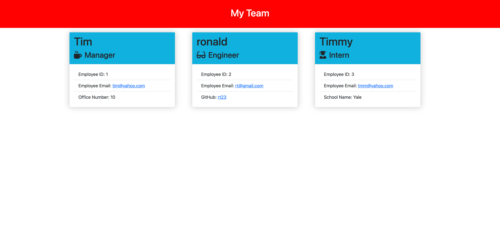

# team-profile-generator
unlicensed
    
## Description
this application asks the manager of a team to enter his/her information and then provide the information for the rest of the team. Teams can consist of one manager who will supervise engineers and/or interns   
[project link](https://github.com/gfernandez25/team-profile-generator)

## Table Of Contents
* [Installation](#user-content-installation)
* [Usage](#user-content-usage)
* [Licenses](#user-content-licenses)
* [Tests](#user-content-tests)
* [Questions](#user-content-questions)
    
## Installation
1. install node
2. install inquirer
3. install jest (for unit testing)
4. run index.js

## Usage
[how to video](https://drive.google.com/file/d/1ehirTfSkx8wSeiuGkRuXi4rUBAmR6yHi/view)

## Screenshot Sample

## License
unlicensed
    
## Contributing
no guidelines at this moment
 
## Tests
manual test only

## Questions
for any questions please check out my GitHub profile: [gfernandez25](https://github.com/gfernandez25)  

